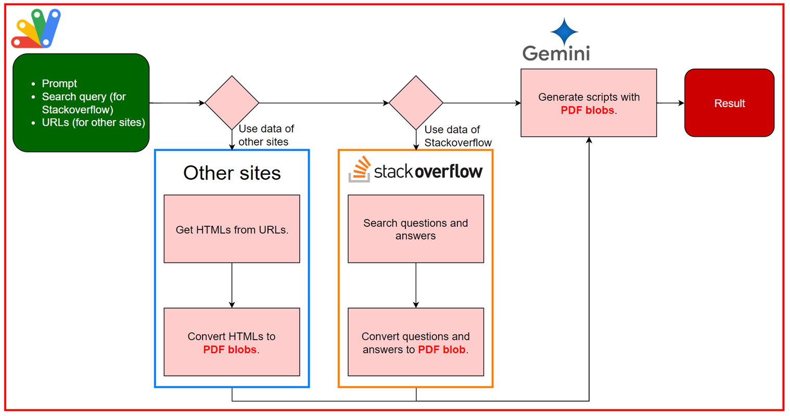

# Gemini-Powered Dynamic Pseudo-RAG for Efficient Script Generation

<a name="top"></a>
[](LICENCE)

<a name="overview"></a>

# Overview

Optimize AI-generated scripts for processing costs using Gemini and Google Apps Script.

# Description

This report explores the use of generative AI, specifically Google Gemini, to create cost-optimized scripts. By incorporating knowledge from external sources, the report demonstrates a method to generate scripts that minimize processing overhead while maintaining desired performance. This approach can be considered a form of dynamic pseudo-RAG.

# Workflow



1. Retrieve HTML from URLs as PDF blobs.
2. Search questions and answers from Stackoverflow using StackExchange API as a PDF blob.
3. Generate scripts using PDF blobs with Gemini API.

# Usage

## 1. Create a Google Apps Script project

Please create a Google Apps Script project. In this case, both the container-bound script and the standalone script can be used.

## 2. Create an API key

Please access [https://ai.google.dev/gemini-api/docs/api-key](https://ai.google.dev/gemini-api/docs/api-key) and create your API key. At that time, please enable Generative Language API at the API console. This API key is used for this sample script.

This official document can also be seen. [Ref](https://ai.google.dev/).

Of course, if you can link the Google Cloud Platform Project to the Google Apps Script Project in the copied Spreadsheet, you can also use the access token.

## 3. Install Google Apps Script libraries

In this script, the Google Apps Script libraries GeminiWithFiles and UtlApp are used. So, please install them. You can see how to install as follows.

- [Install GeminiWithFiles](https://github.com/tanaikech/GeminiWithFiles?tab=readme-ov-file#1-use-geminiwithfiles-as-a-google-apps-script-library)
- [Install UtlApp](https://github.com/tanaikech/UtlApp?tab=readme-ov-file#1-install-library)

## 4. Main script

Please copy and paste the following script to the script editor of your created Google Apps Script project. This is the main class. This class object is used with the following sample scripts.

```javascript
/**
 * Class object for generating scripts using Gemini API.
 * @class
 */
class GenerateScript {
  constructor(obj) {
    // forGemini
    if (obj.forGemini) {
      /** @private */
      this.prompt = obj.forGemini.prompt || "";

      /** @private */
      this.apiKey = obj.forGemini.apiKey || "";

      /** @private */
      this.model = obj.forGemini.model;
    }

    // forStackoverflow
    /** @private */
    this.useStackoverflow = !!obj.forStackoverflow;
    if (this.useStackoverflow) {
      /** @private */
      this.onlySearchQuestions =
        obj.forStackoverflow.onlySearchQuestions || false;

      /** @private */
      this.exportPDF = obj.forStackoverflow.exportPDF || false;

      /** @private */
      this.searchQuery = obj.forStackoverflow.searchQuery;

      /** @private */
      this.searchTags = obj.forStackoverflow.searchTags;

      /** @private */
      this.numberOfQuestions = obj.forStackoverflow.numberOfQuestions || 10;

      /** @private */
      this.stackExchangeAPIURL =
        "https://api.stackexchange.com/2.3/search/advanced";

      /** @private */
      this.stackExchangeAPIObj = {
        access_token: obj.forStackoverflow.access_token,
        key: obj.forStackoverflow.key,
        pagesize: 100,
        order: "desc",
        sort: "relevance",
        accepted: true,
        closed: false,
        migrated: false,
        notice: false,
        wiki: false,
        site: "stackoverflow",
        filter: "!-tS9_NPV1puxkptfqnI5",
      };
    }

    // forOtherSites
    /** @private */
    this.useOtherSites = !!obj.forOtherSites;
    if (
      this.useOtherSites &&
      obj.forOtherSites.urls &&
      Array.isArray(obj.forOtherSites.urls)
    ) {
      /** @private */
      this.otherSiteUrls = obj.forOtherSites.urls;
    }
  }

  /**
   * ### Description
   * Main method.
   *
   * @return {String} Text including the generated script.
   */
  run() {
    let blobs = [];

    if (this.useOtherSites) {
      console.log(`--- Retrieving the related information from other sites.`);
      const temp = this.otherSiteUrls.map((url) =>
        this.convertHTMLToPDFBlob_({ url, convertByGoogleDoc: false })
      );
      blobs.push(...temp);
    }

    if (this.useStackoverflow) {
      console.log(
        `--- Searching the related questions and answers from Stackoverflow.`
      );
      const temp = this.getQuestionsAndAnswersFromStackoverflow_();
      console.log(
        `--- ${temp.length} questions for supporting to generate script were retrieved.`
      );
      if (this.onlySearchQuestions && !this.exportPDF) {
        return temp;
      }
      const blob = this.createPDFFromStackExchangeAPI_(
        temp.splice(0, this.numberOfQuestions)
      );
      blobs.push(blob);
      if (this.exportPDF) {
        console.log(
          `--- Exporting the searched questions and answers as a PDF file to the root folder.`
        );
        const file = DriveApp.createFile(blob);
        if (this.onlySearchQuestions) {
          return file.getUrl();
        }
      }
    }

    return this.getScript_(blobs);
  }

  /**
   * ### Description
   * Search questions and answers from Stackoverflow using StackExchange API.
   *
   * @return {Array} Array including the searched questions and answers.
   * @private
   */
  getQuestionsAndAnswersFromStackoverflow_() {
    this.stackExchangeAPIObj.q = this.searchQuery;
    this.stackExchangeAPIObj.tagged = this.searchTags.join(";");
    const url = UtlApp.addQueryParameters(
      this.stackExchangeAPIURL,
      this.stackExchangeAPIObj
    );
    return JSON.parse(UrlFetchApp.fetch(url).getContentText()).items;
  }

  /**
   * ### Description
   * Search questions and answers from Stackoverflow using StackExchange API.
   *
   * @param {Array} blobs PDF blobs.
   * @return {String} Generated content using Gemini API.
   * @private
   */
  getScript_(blobs) {
    console.log(`--- Generate script from your prompt.`);
    let g = new GeminiWithFiles.geminiWithFiles({
      apiKey: this.apiKey,
      model: this.model,
      response_mime_type: "application/json",
    });
    let q;
    if (blobs.length > 0) {
      console.log(
        `--- Generate script using the referenced questions and answers of Stackoverflow or other sites.`
      );
      q = [
        `<MainQuestion>${this.prompt}</MainQuestion>`,
        `First, understand the questions and answers in the following PDF.`,
        `As tne next step, you are required to generate a more efficient script for "MainQuestion" by referencing the questions and answers from Stackoverflow in the following PDF.`,
        `PDF includes the suitable questions and answers from Stackoverflow. You are required to generate more efficient script by understanding PDF.`,
      ].join("\n");
      const fileList = g.setBlobs(blobs).uploadFiles();
      g = g.withUploadedFilesByGenerateContent(fileList);
    } else {
      console.log(
        `--- Generate script without using the refferenced questions and answers of Stackoverflow and other sites.`
      );
      q = this.prompt;
    }
    const jsonSchema = {
      description: q,
      type: "object",
      properties: {
        script: { description: "Generated script.", type: "string" },
        descriptionOfScript: {
          description: "Description of the generated script.",
          type: "string",
        },
      },
    };
    return g.generateContent({ jsonSchema });
  }

  /**
   * ### Description
   * Create PDF blob from the search result.
   *
   * @param {Array} items Items including the searched questions and answers.
   * @return {Blob} PDF blob converted from HTML of the URL is returned.
   * @private
   */
  createPDFFromStackExchangeAPI_(items) {
    console.log(`--- Create HTML.`);
    const { htmlBody, links } = items.reduce(
      (o, { answers, body, title, link }, i) => {
        const temp = [
          `<h1>Question ${i + 1}</h1>`,
          `<h2>Title: <a href="${link}">${title}</a></h2>`,
          body,
          `<h2>Solved answer to question ${i + 1}</h2>`,
          answers.find((e) => e.is_accepted).body,
        ].join("");
        o.htmlBody.push(temp);
        o.links.push(link);
        return o;
      },
      { htmlBody: [], links: [] }
    );
    console.log(`--- Links of searched questions on Stackoverflow.`);
    console.log(links);
    let text = `<!DOCTYPE html><html><head><base target="_top"><style>h1 { page-break-before: always; }</style></head><body>${htmlBody.join(
      ""
    )}</body></html>`;

    console.log(`--- Convert image data.`);
    text.matchAll(//g).forEach((e) => {
      const t = e[0].match(/src\=["'](http.*?)["']/);
      if (t) {
        const imageUrl = t[1];
        const r = UrlFetchApp.fetch(imageUrl.trim(), {
          muteHttpExceptions: true,
        });
        if (r.getResponseCode() == 200) {
          const blob = r.getBlob();
          const dataUrl = `data:${blob.getContentType()};base64,${Utilities.base64Encode(
            blob.getBytes()
          )}`;
          text = text.replace(e[0], ``);
        }
      }
    });

    console.log(`--- Convert HTML to PDF blob.`);
    const pdfBlob = Utilities.newBlob(text, MimeType.HTML)
      .getAs(MimeType.PDF)
      .setName("GenerateScriptTempFile.pdf");
    console.log(`--- Completely converted HTML to PDF blob.`);
    return pdfBlob;
  }

  /**
   * ### Description
   * Convert HTML of the inputted URL to PDF blob.
   * ref: https://medium.com/google-cloud/expanding-gemini-apis-capabilities-a-practical-solution-for-web-content-summarization-5617474b2ad1
   *
   * @param {Object} object Object for running this method.
   * @param {String} object.url URL you want to use.
   * @param {Boolean} object.convertByGoogleDoc When this is true, in order to convert HTML to PDF, Google Document is used. I think that the most cases are not required to use this. But, if you use this, please set "convertByGoogleDoc" as true. The default value is false.
   *
   * @return {Blob} PDF blob converted from HTML of the URL is returned.
   * @private
   */
  convertHTMLToPDFBlob_(object) {
    const { url, convertByGoogleDoc = false } = object;
    console.log(`--- Get HTML from "${url}".`);
    const res = UrlFetchApp.fetch(url, { muteHttpExceptions: true });
    let text = res.getContentText();
    if (res.getResponseCode() != 200) {
      throw new Error(text);
    }
    console.log(`--- Convert image data.`);

    // Convert the source URL of img tag to the data URL.
    text.matchAll(//g).forEach((e) => {
      const t = e[0].match(/src\=["'](http.*?)["']/);
      if (t) {
        const imageUrl = t[1];
        const r = UrlFetchApp.fetch(imageUrl.trim(), {
          muteHttpExceptions: true,
        });
        if (r.getResponseCode() == 200) {
          const blob = r.getBlob();
          const dataUrl = `data:${blob.getContentType()};base64,${Utilities.base64Encode(
            blob.getBytes()
          )}`;
          // text = text.replace(imageUrl, dataUrl);
          text = text.replace(e[0], ``);
        }
      }
    });

    // For medium
    if (url.includes("medium.com")) {
      text.matchAll(/<picture>.*?<\/picture>/g).forEach((e) => {
        const t = e[0].match(/srcSet\=["'](http.*?)["']/);
        if (t) {
          const imageUrl = t[1].split(" ")[0].trim();
          const r = UrlFetchApp.fetch(imageUrl.trim(), {
            muteHttpExceptions: true,
          });
          if (r.getResponseCode() == 200) {
            const blob = r.getBlob();
            const dataUrl = `data:${blob.getContentType()};base64,${Utilities.base64Encode(
              blob.getBytes()
            )}`;
            text = text.replace(e[0], `<img src="${dataUrl}"`);
          }
        }
      });
    }

    let pdfBlob;
    if (convertByGoogleDoc) {
      console.log(`--- Convert HTML to PDF blob with Google Docs.`);
      const doc = Drive.Files.create(
        { name: "temp", mimeType: MimeType.GOOGLE_DOCS },
        Utilities.newBlob(text, MimeType.HTML)
      );
      pdfBlob = DriveApp.getFileById(doc.id).getBlob().setName(url);
      Drive.Files.remove(doc.id);
    } else {
      console.log(`--- Convert HTML to PDF blob.`);
      pdfBlob = Utilities.newBlob(text, MimeType.HTML)
        .getAs(MimeType.PDF)
        .setName(url);
    }
    console.log(`--- Completely converted HTML to PDF blob.`);
    return pdfBlob;
  }
}
```

### 1. When you want to generate a script only with your prompt

```javascript
function sample() {
  const prompt = "### your prompt ###";
  const object = {
    forGemini: {
      model: "models/gemini-1.5-pro-exp-0827", // or "models/gemini-1.5-pro-latest" or "models/gemini-1.5-flash-latest"
      apiKey: "###", // Please set your API key for using Gemini API.
      prompt,
    },
  };
  const res = new GenerateScript(object).run();
  console.log(res.script);
  console.log(res.descriptionOfScript);
}
```

### 2. When you want to generate a script with your prompt and the sources from Stackoverflow

```javascript
function sample1() {
  const prompt = "### your prompt ###";
  const object = {
    forGemini: {
      model: "models/gemini-1.5-pro-exp-0827", // or "models/gemini-1.5-pro-latest" or "models/gemini-1.5-flash-latest"
      apiKey: "###", // Please set your API key for using Gemini API.
      prompt,
    },
    forStackoverflow: {
      access_token: "###", // Please set your access token for using StackExchange API.
      key: "###", // Please set your key for using StackExchange API.
      // exportPDF: true, // When you use this, the retrieved questions and answers are exported as a PDF file to the root folder.
      // numberOfQuestions: 5, // When you use this, you can control the number of questions.
      searchQuery: "###", // Please set your search query like "move rows speed".
      searchTags: ["###", "###", , ,], // Please set the related tags like "google-apps-script", "google-sheets"
    },
  };
  const res = new GenerateScript(object).run();
  console.log(res.script);
  console.log(res.descriptionOfScript);
}
```

### 3. When you want to generate a script with your prompt and the sources from other sites except for Stackoverflow

```javascript
function sample() {
  const prompt = "### your prompt ###";
  const object = {
    forGemini: {
      model: "models/gemini-1.5-pro-exp-0827", // or "models/gemini-1.5-pro-latest" or "models/gemini-1.5-flash-latest"
      apiKey: "###", // Please set your API key for using Gemini API.
      prompt,
    },
    forOtherSites: { urls: ["###", "###", , ,] }, //  Please set the URLs you want to use as the sources for generating the script.
  };
  const res = new GenerateScript(object).run();
  console.log(res.script);
  console.log(res.descriptionOfScript);
}
```

### 4. When you want to generate a script with your prompt and the sources from both Stackoverflow and other sites except for Stackoverflow

```javascript
function sample() {
  const prompt = "### your prompt ###";
  const object = {
    forGemini: {
      model: "models/gemini-1.5-pro-exp-0827", // or "models/gemini-1.5-pro-latest" or "models/gemini-1.5-flash-latest"
      apiKey: "###", // Please set your API key for using Gemini API.
      prompt,
    },
    forStackoverflow: {
      access_token: "###", // Please set your access token for using StackExchange API.
      key: "###", // Please set your key for using StackExchange API.
      // exportPDF: true, // When you use this, the retrieved questions and answers are exported as a PDF file to the root folder.
      // numberOfQuestions: 5, // When you use this, you can control the number of questions.
      searchQuery: "###", // Please set your search query like "move rows speed".
      searchTags: ["###", "###", , ,], // Please set the related tags like "google-apps-script", "google-sheets"
    },
    forOtherSites: { urls: ["###", "###", , ,] }, //  Please set the URLs you want to use as the sources for generating the script.
  };
  const res = new GenerateScript(object).run();
  console.log(res.script);
  console.log(res.descriptionOfScript);
}
```

# Sample situations

Here, I would like to introduce 2 sample situations.

## 1. Situation 1

In order to test the above script, the following prompt is used.

```
About "Condition" and "Mission", run "Mission" with "Condition".

<Condition>
- There is a Google Spreadsheet including "Sheet1" and "Sheet2".
- "Sheet1" has 1000 rows including the first header row and 10 columns.
</Condition>

<Mission>
- Create a script that can efficiently move only rows where the column "A" is not empty from "Sheet1" to "Sheet2" on a Google Spreadsheet using Google Apps Script with low processing costs.
</Mission>
```

In this sample Spreadsheet, the total number of rows is 1000, and the rows without empty in column "A" are 500.

In these sample scripts, the model of `models/gemini-1.5-pro-exp-0827` is used. If this model is updated when you test this script, please check the latest model and use it. It's like `models/gemini-1.5-pro-latest` and `models/gemini-1.5-flash-latest`.

### 1. Sample 1

This sample generates a script using **only the prompt**.

```javascript
function sample1() {
  const prompt = [
    `About "Condition" and "Mission", run "Mission" with "Condition".`,
    `<Condition>`,
    `- There is a Google Spreadsheet including "Sheet1" and "Sheet2".`,
    `- "Sheet1" has 1000 rows including the first header row and 10 columns.`,
    `</Condition>`,
    `<Mission>`,
    `- Create a script that can efficiently move only rows where the column "A" is not empty from "Sheet1" to "Sheet2" on a Google Spreadsheet using Google Apps Script with low processing costs.`,
    `</Mission>`,
  ].join("\n");

  const object = {
    forGemini: {
      model: "models/gemini-1.5-pro-exp-0827", // or "models/gemini-1.5-pro-latest" or "models/gemini-1.5-flash-latest"
      apiKey: "###", // Please set your API key for using Gemini API.
      prompt,
    },
  };
  const res = new GenerateScript(object).run();

  console.log(res.script);
  console.log(res.descriptionOfScript);
}
```

When this script is run, the following script is generated.

```javascript
function moveRows() {
  const ss = SpreadsheetApp.getActiveSpreadsheet();
  const sheet1 = ss.getSheetByName("Sheet1");
  const sheet2 = ss.getSheetByName("Sheet2");

  const values = sheet1.getDataRange().getValues();
  const rowsToMove = [];

  // Iterate through rows starting from the second row (index 1)
  for (let i = 1; i < values.length; i++) {
    const row = values[i];
    if (row[0] !== "") {
      // Check if column A is not empty
      rowsToMove.push(row);
    }
  }

  // Add the rows to Sheet2
  sheet2
    .getRange(
      sheet2.getLastRow() + 1,
      1,
      rowsToMove.length,
      rowsToMove[0].length
    )
    .setValues(rowsToMove);

  // Delete the moved rows from Sheet1 (iterate in reverse to avoid index issues)
  for (let i = values.length - 1; i >= 1; i--) {
    if (values[i][0] !== "") {
      sheet1.deleteRow(i + 1);
    }
  }
}
```

When this script is run, the rows without empty in column "A" are copied from "Sheet1" to "Sheet2". And, those rows are deleted. The script works. In this case, the processing time was about 130 seconds for processing 1000 rows.

### 1. Sample 2

This sample generates a script using **both the prompt and the questions and answers from Stackoverflow**.

When you use this script, please set your API key for using Gemini API. And, your access token and key for using StackExchange API.

```javascript
function sample2() {
  const prompt = [
    `About "Condition" and "Mission", run "Mission" with "Condition".`,
    `<Condition>`,
    `- There is a Google Spreadsheet including "Sheet1" and "Sheet2".`,
    `- "Sheet1" has 1000 rows including the first header row and 10 columns.`,
    `</Condition>`,
    `<Mission>`,
    `- Create a script that can efficiently move only rows where the column "A" is not empty from "Sheet1" to "Sheet2" on a Google Spreadsheet using Google Apps Script with low processing costs.`,
    `</Mission>`,
  ].join("\n");

  const object = {
    forGemini: {
      model: "models/gemini-1.5-pro-exp-0827", // or "models/gemini-1.5-pro-latest" or "models/gemini-1.5-flash-latest"
      apiKey: "###", // Please set your API key for using Gemini API.
      prompt,
    },
    forStackoverflow: {
      access_token: "###", // Please set your access token for using StackExchange API.
      key: "###", // Please set your key for using StackExchange API.
      searchQuery: "move rows speed",
      searchTags: ["google-apps-script", "google-sheets"],
    },
  };
  const res = new GenerateScript(object).run();

  console.log(res.script);
  console.log(res.descriptionOfScript);
}
```

In this case, the following threads on Stackoverflow using `searchQuery` and `searchTags` are used for support in generating the script.

- `https://stackoverflow.com/questions/74518062/how-to-speed-up-moverows-script`
- `https://stackoverflow.com/questions/56475238/pulling-data-from-google-sheets-into-html-table`
- `https://stackoverflow.com/questions/64777655/google-script-timing-out`
- `https://stackoverflow.com/questions/52777954/how-to-get-actual-position-of-range-when-new-rows-above-was-added`
- `https://stackoverflow.com/questions/44013438/slow-google-script-difficulties-batching-information-into-an-array`
- `https://stackoverflow.com/questions/47041116/script-is-taking-11-20-seconds-to-lookup-up-an-item-in-an-18-000-row-data-set`

When this script is run, the following script is generated.

```javascript
function moveRows() {
  var ss = SpreadsheetApp.getActive();
  var srcSheet = ss.getSheetByName("Sheet1");
  var dstSheet = ss.getSheetByName("Sheet2");
  var srcRange = srcSheet.getDataRange();
  var values = srcRange.getValues();
  var { src, dst } = values.reduce(
    (o, r) => {
      o[r[0] ? "dst" : "src"].push(r);
      return o;
    },
    { src: [], dst: [] }
  );
  if (dst.length == 0) return;
  srcRange
    .clearContent()
    .offset(0, 0, src.length, src[0].length)
    .setValues(src);
  dstSheet
    .getRange(dstSheet.getLastRow() + 1, 1, dst.length, dst[0].length)
    .setValues(dst);
}
```

When this script is run, all rows are retrieved. These rows are then divided into two groups: those with empty values in column 'A' and those without. 'Sheet1' is cleared, and the rows with empty values in column 'A' are copied to it. Subsequently, the rows without empty values in column 'A' are also copied to 'Sheet1'. The script functions as expected. In a test with 1000 rows, the processing time was approximately 3 seconds.

Comparing the results of 'Sample 1' and 'Sample 2', we observed a significant reduction in processing time from 130 seconds to 3 seconds.

In the development of this script, valuable information to aid in its creation was directly sourced from StackOverflow and integrated with Gemini. This approach facilitated efficient script generation and may be considered a form of pseudo-RAG.

## 1. Situation 2

In order to test the above script, the following prompt is used.

```
About "Condition" and "Mission", run "Mission" with "Condition".

<Condition>
- There is a Google Spreadsheet including "Sheet1".
- "Sheet1" has 100000 rows and 10 columns.
- Various values are put into all cells.
</Condition>

<Mission>
- Create a script that can efficiently search for a value from "Sheet1" using Google Apps Script with low processing costs.
</Mission>
```

### 1. Sample 1

This sample generates a script using **only the prompt**.

```javascript
function sample1() {
  const prompt = [
    `About "Condition" and "Mission", run "Mission" with "Condition".`,
    `<Condition>`,
    `- "Sheet1" has 100000 rows and 10 columns.`,
    `- Various values are put into all cells.`,
    `</Condition>`,
    `<Mission>`,
    `- Create a script that can efficiently search for a value from "Sheet1" using Google Apps Script with low processing costs.`,
    `- Return the result as an array including A1Notation.`,
    `</Mission>`,
  ].join("\n");
  const object = {
    forGemini: {
      model: "models/gemini-1.5-pro-exp-0827", // or "models/gemini-1.5-pro-latest" or "models/gemini-1.5-flash-latest"
      apiKey: "###", // Please set your API key for using Gemini API.
      prompt,
    },
  };
  const res = new GenerateScript(object).run();
  console.log(res.script);
  console.log(res.descriptionOfScript);
}
```

When this script is run, the following script is generated.

```javascript
/**
 * Searches for a value in Sheet1 and returns an array of A1 notations.
 *
 * @param {string} value The value to search for.
 * @return {Array<string>} An array of A1 notations where the value was found.
 */
function searchForValue(value) {
  const sheet = SpreadsheetApp.getActiveSpreadsheet().getSheetByName("Sheet1");
  const data = sheet.getDataRange().getValues();
  const result = [];

  for (let row = 0; row < data.length; row++) {
    for (let col = 0; col < data[row].length; col++) {
      if (data[row][col] === value) {
        result.push(sheet.getCell(row + 1, col + 1).getA1Notation());
      }
    }
  }

  return result;
}
```

When this script is run with the search value, all values are retrieved from "Sheet1". And, the value is searched using the loop. When the search value is found, the A1Notation of the cell is retrieved by `sheet.getCell(row + 1, col + 1).getA1Notation()`. But, unfortunately, there is no method of `getCell` in the class sheet. So, the script doesn't work. When `getCell` is modified to `getRange`, the script works. In this case, the processing time was about 12 seconds for processing 100,000 rows and 10 columns.

### 1. Sample 2

This sample generates a script using **both the information of other web site**. In this case, the post of my blog is used. [Ref](https://tanaikech.github.io/)

When you use this script, please set your API key for using Gemini API, and also set the URLs for support to generate the script.

```javascript
function sample2() {
  const prompt = [
    `About "Condition" and "Mission", run "Mission" with "Condition".`,
    `<Condition>`,
    `- "Sheet1" has 100000 rows and 10 columns.`,
    `- Various values are put into all cells.`,
    `</Condition>`,
    `<Mission>`,
    `- Create a script that can efficiently search for a value from "Sheet1" using Google Apps Script with low processing costs.`,
    `- Return the result as an array including A1Notation.`,
    `</Mission>`,
  ].join("\n");
  const object = {
    forGemini: {
      model: "models/gemini-1.5-pro-exp-0827", // or "models/gemini-1.5-pro-latest" or "models/gemini-1.5-flash-latest"
      apiKey: "###", // Please set your API key for using Gemini API.
      prompt,
    },
    forOtherSites: {
      urls: [
        "https://tanaikech.github.io/2020/09/30/benchmark-process-costs-for-searching-values-in-spreadsheet-using-google-apps-script/",
      ],
    },
  };
  const res = new GenerateScript(object).run();
  console.log(res.script);
  console.log(res.descriptionOfScript);
}
```

When this script is run, the following script is generated.

```javascript
function searchValues(spreadsheetId, sheetName, searchValue) {
  const sheet =
    SpreadsheetApp.openById(spreadsheetId).getSheetByName(sheetName);
  return sheet
    .createTextFinder(searchValue)
    .findAll()
    .map((range) => range.getA1Notation());
}
```

When this script is run by giving the arguments, the value can be correctly searched. The script works. In this case, the processing time was about 2 seconds for processing 100,000 rows and 10 columns.

Comparing the results of Sample 1 and Sample 2, we observed a significant reduction in processing time from 12 seconds to 2 seconds. This also suggests the importance of the supplemental information.

# Note

- This script is a Google Apps Script. I used it because when Google Apps Script is used, authorization for using Google Docs and the files on Google Drive can be done seamlessly. The language in the sample prompt is Google Apps Script. However, in this case, you can generate the scripts for other languages using this script.

---

<a name="licence"></a>

# Licence

[MIT](LICENCE)

<a name="author"></a>

# Author

[Tanaike](https://tanaikech.github.io/about/)

[Donate](https://tanaikech.github.io/donate/)

<a name="updatehistory"></a>

# Update History

- v1.0.0 (September 12, 2024)

  1. Initial release.

[TOP](#top)
